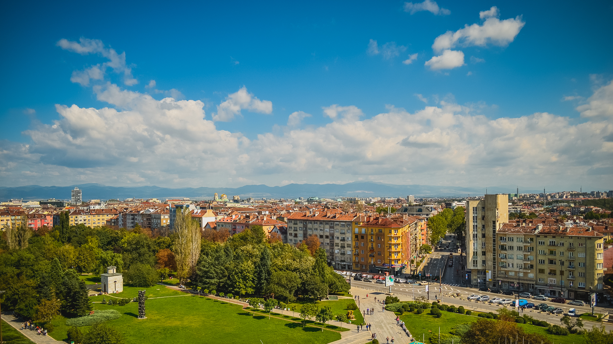
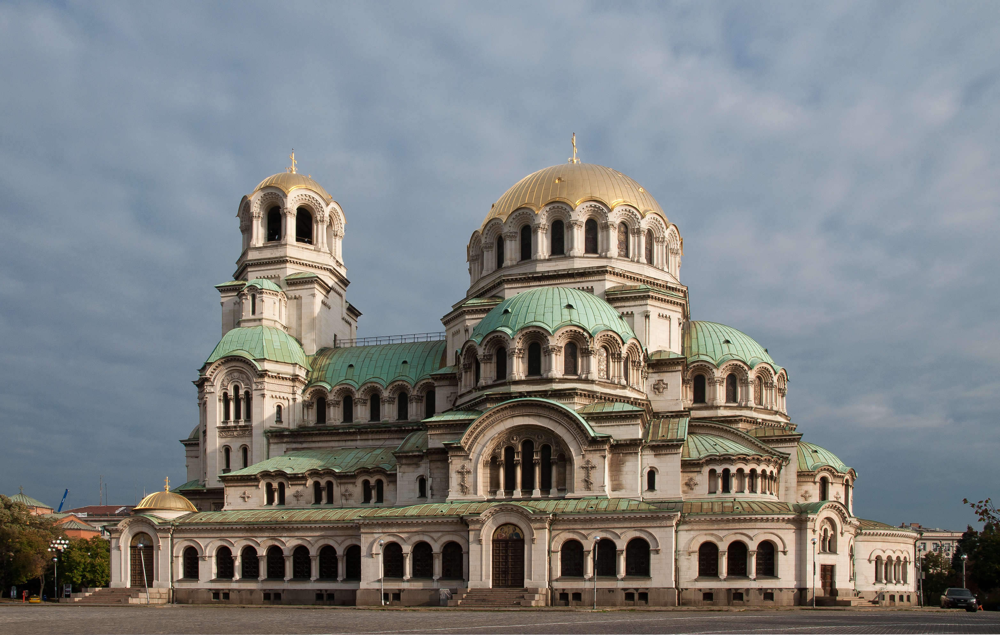
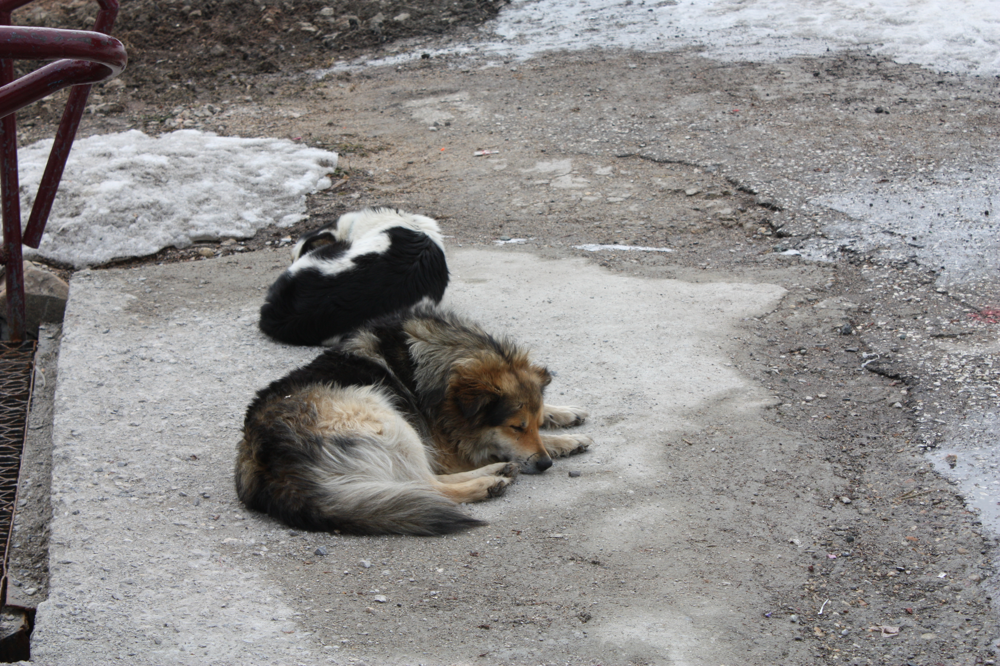

# Day 1: Sofia Arrival

## Logistics
- **Start**: Sofia Airport (SOF) arrival at **12:00 PM** Sept 12, 2026
- **Destination**: Sofia city center accommodation
- **ETA**: Check-in by **2:00 PM** after car pickup
- **Driving time/distance**: 10-15 min from airport to city center
- **Car pickup**: At SOF rental center, vignette purchase prep
- **Border crossings**: None (domestic arrival)

## Trails (AllTrails) - Light afternoon option
- **Optional afternoon hike**: Vitosha Mountain - Aleko Chairlift to Cherni Vrah (highest peak, 2,290 m)
  - Distance: **~6 km** round trip
  - Elevation gain: **~480 m** (Aleko hut 1,810m → Cherni Vrah 2,290m)
  - Route type: Out-and-back via marked trail from Aleko hut
  - Difficulty: Moderate (well-marked, no scrambling)
  - Trailhead: Aleko Chairlift station (Vitosha Mountain, 1,810m)
  - Notes: Take chairlift up from Simeonovo (1,810m → Malak Rezen 2,191m), then marked trail to summit (2,290m). Panoramic views of Sofia from the top. Total 480m elevation gain makes this a solid moderate hike. September weather ideal. Bring layers.
  - **Trail source:** [Aleko Hut - Cherni Vrah](https://www.alltrails.com/trail/bulgaria/sia/aleko-hut-cherni-vrah) — AllTrails (verified real trail, 3.7 mi out-and-back, 1,568 ft elevation gain, Hard difficulty, 84 reviews; direct route from Aleko hut to summit at 2,290m)
- **Alternative**: Borisova Gradina park walk in city center (3km flat, easy recovery walk)

## Accommodations
- Search criteria used: "Sofia city center apartment near Alexander Nevsky Cathedral, parking, kitchen"
- Examples:
  1. [Hip Urban Hideaway](https://www.airbnb.com/sofia-center-bulgaria/stays) - **€70-90/night**, 2BR, walking distance to landmarks, secure parking
  2. [Nordic-Style Apartment](https://www.airbnb.com/sofia-center-bulgaria/stays) - **€55-75/night**, 1BR, traditional Bulgarian architecture, elevator
  3. [Sophisticated Modern Hideaway](https://www.airbnb.com/sofia-center-bulgaria/stays) - **€50-70/night**, studio, new building, gym in building, parking garage
- Check-in time: 3:00 PM standard, early check-in possible
- Parking availability: On-site or street parking with permit

## Meals
- Breakfast: Light airport snack or hotel continental (if arriving early)
- Lunch: [Made in Home](https://www.google.com/maps/search/Made+in+Home+restaurant+Sofia) - traditional Bulgarian shop near Tsaritsa Ioanna Blvd, try banitsa and shopska salad (**€8-12**)
- Dinner: [Shtastlivetza](https://www.google.com/maps/search/Shtastlivetza+restaurant+Sofia) - Bulgarian meat restaurant near Vitosha Boulevard, kavarma and grilled meats (**€15-25/person**), reservation recommended

## Activities & Attractions (nearby, non-hiking)
- Alexander Nevsky Cathedral (open 7AM-7PM, free entry, iconic gold domes)
- Saint Sophia Church (2-4 EUR entry, ancient church beneath)
- Central Sofia Mineral Baths (now museum, beautiful architecture)
- Borisova Gradina Park (large central park, walking trails, lake)
- National Palace of Culture (events, exhibitions, great people-watching)

## Links & Images
- Cathedral: [Alexander Nevsky Cathedral](https://en.wikipedia.org/wiki/Alexander_Nevsky_Cathedral,_Sofia)
- Vitosha Mountain: [Vitosha Nature Park](https://en.wikipedia.org/wiki/Vitosha)
- Borisova Gradina: [Borisova Gradina Park](https://en.wikipedia.org/wiki/Borissova_gradina_(Sofia))
- Image refs: 
  - 
  - 
  - 