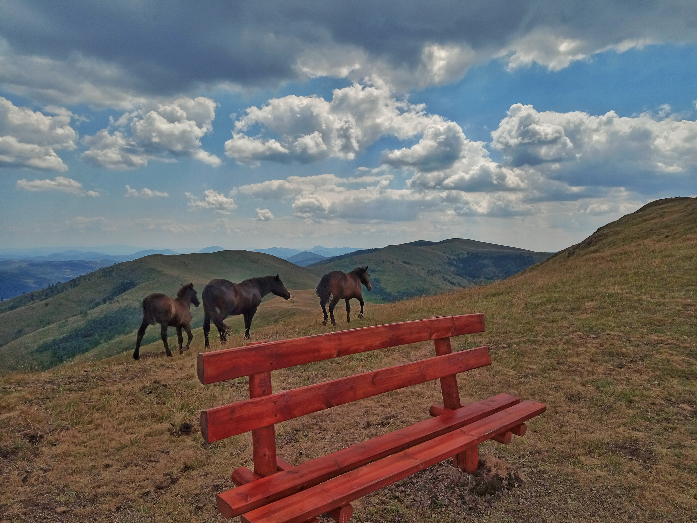
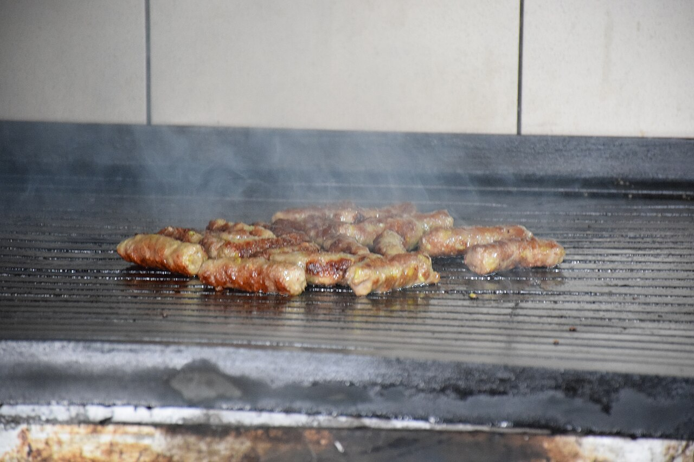

# Day 2: Sofia → Kosmovac (Zlatibor Region)

## Logistics

- **Start:** Sofia city center (Day 1 accommodation) at **8:00 AM**
- **Destination:** Kosmovac, Serbia (Zlatibor region)
- **ETA:** Mid-afternoon (**1:30–2:00 PM** local time)
- **Driving time:** **~3 hours** / **250 km**
- **Border crossing:** Kalotina (Bulgaria) ↔ Gotse Delchev (Serbia)
  - **Expected wait:** **15–45 minutes**
  - **Required docs:** **Passport**, **Green Card** (insurance)
  - **Vignette:** Serbian vignette (**~€15** for 7-day, buy at border)
- **Route:** **E80** west from Sofia to Kalotina, then **A4/M5** north to Belgrade area, exit toward Kosmovac/Zlatibor
- **Road conditions:** Good highway to border, scenic mountain roads after
- **Tolls:** Minimal on this route, vignette covers most

## Trails (AllTrails)

- **Zlatibor Cavlovac Summit Trail** — Day 2 highlight (near Kosmovac)
  - **Trail:** Zlatibor Cavlovac (ZlatiborskaČeotina / Cavlovac peak)
  - **Distance:** **~7 km** round trip
  - **Elevation gain:** **~500 m**
  - Route type: Out-and-back
  - **Difficulty:** Moderate (well-marked forest trail to panoramic peak)
  - Trailhead: Cavlovac trailhead, Zlatibor ski resort area (~43.72° N, 19.71° E)
  - Notable features:
    - Panoramic views over Zlatibor plateau and surrounding mountains
    - Well-marked trail, popular local hike
    - Good sunset spot from summit
    - Accessible from Kosmovac / Zlatibor area (Day 2 afternoon)
  - **Trail source:** [Zlatibor Cavlovac](https://www.alltrails.com/trail/serbia/zlatiborski-upravni-okrug/zlatibor-cavlovac) — AllTrails verified trail in Zlatibor area
- **Alternative:** Nearby Zlatibor area has 60+ AllTrails trails — check accommodation host for recommendations

## Accommodations

- **Search criteria used:** "Airbnb cabin in Kosmovac Serbia, fireplace, mountain view, parking, Zlatibor area"
- **Examples:**
  1. [Traditional Mountain House](https://www.airbnb.com/zlatibor-serbia/stays/cabins) — **€60-80/night**, 2BR, fireplace, panoramic mountain views, outdoor seating area, 4x4 access recommended
  2. [Modern Mountain Apartment](https://www.airbnb.com/zlatibor-serbia/stays/apartments) — **€60-75/night**, 3BR, authentic décor, garden, BBQ, located in village center
  3. [House with Wood-Burning Fireplace](https://www.airbnb.com/sevojno-serbia/stays) — **€70-90/night**, 1BR loft, hot tub, mountain design, private parking, near Zlatibor ski resort
- **Check-in time:** Flexible afternoon/evening (message host)
- **Parking:** Free on-property, unpaved access road
- **Kitchen access:** Full kitchen for self-catering

## Meals

- **Breakfast:** Continental breakfast at accommodation (if provided) or self-catering with local ingredients
- **Lunch (en route):** [Restoran Stari Hrast](https://www.google.com/maps/search/Restoran+Stari+Hrast+Prijepolje+Serbia) — Traditional Serbian restaurant near Prijepolje, cevapcici and burek (**€10–15/person**)
- **Dinner:** [Vodenica Restaurant](https://www.google.com/maps/search/Vodenica+restaurant+Kosmovac+Serbia) — Riverside restaurant in Kosmovac area, fresh trout, ajvar, kajmak, local specialties (**€15–20/person**)
- **Note:** Kosmovac is a small village; stock up on provisions in Prijepolje or Nova Varos before arriving

## Activities & Attractions (nearby, non-hiking)

- **Uvac Canyon viewpoints** (prepare for Day 3 — already see it from distance)
- **Zlatibor Mountain** (ski resort area, chairlift rides available, **30-min drive**)
- **Sjenica Ušak Fortress ruins** (medieval, free entry, panoramic views)
- **Stopica Cave** (if time permits, **20-min detour**, **€5–8** entry)
- **Local Orthodox monasteries:** Kosmacevac Monastery (**10 min drive**, active monastery, donations welcome)

## Links & Images

- Serbian vignette info: [AMSS Vignette](https://en.wikipedia.org/wiki/Vignette_(road_toll)#Serbia)
- Zlatibor tourism: [Zlatibor Official](https://www.zlatibor.travel/en)
- Stopica Cave: [Stopica Cave](https://en.wikipedia.org/wiki/Stopica_cave)
- Image refs:
  - 
  - 
  - 