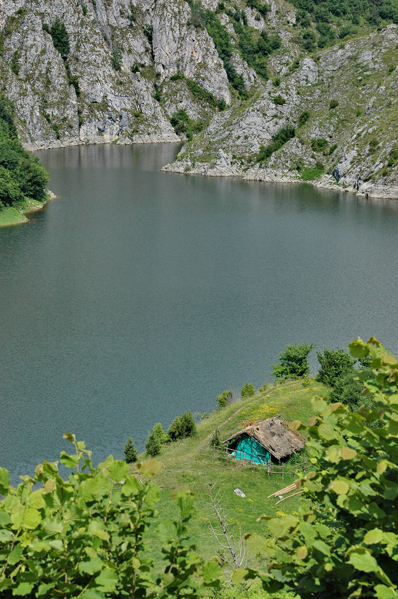
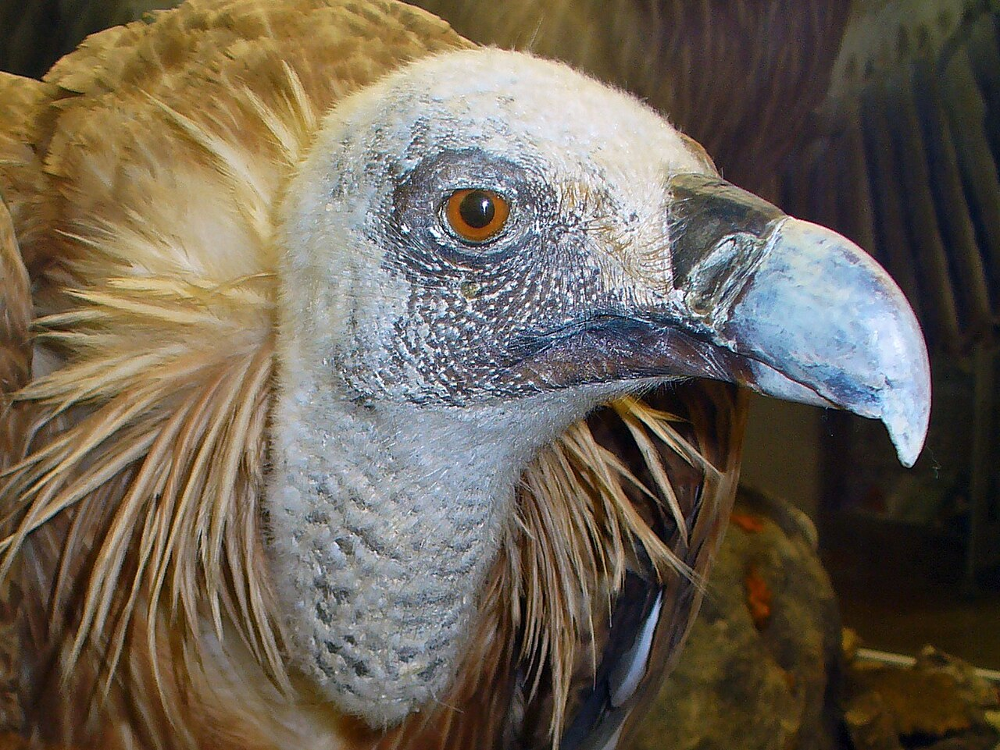
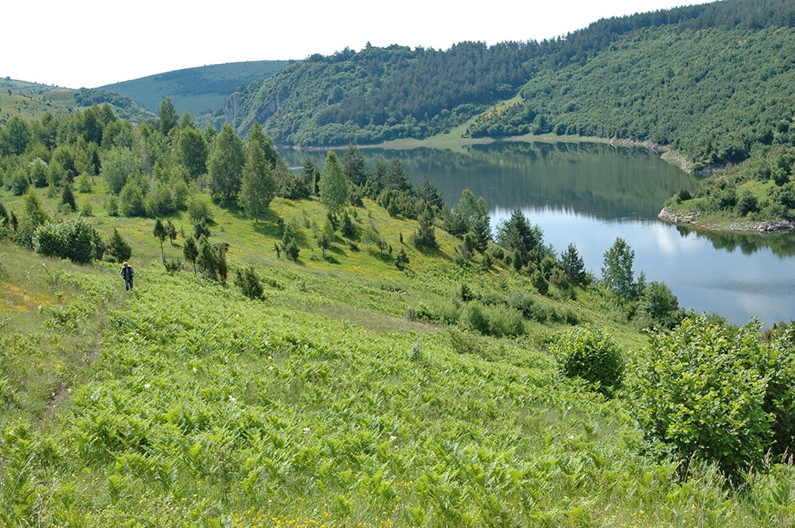
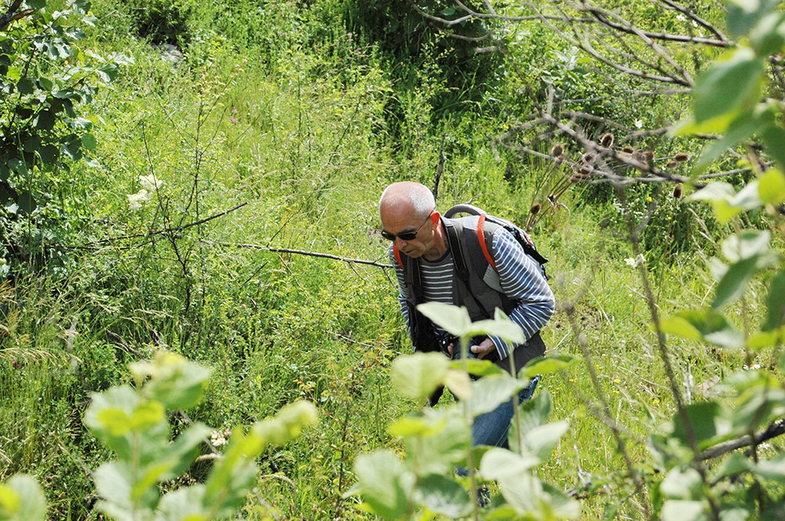

## Logistics
- **Start**: Kosmovac accommodation at 8:00 AM
- **Destination**: Uvac Canyon, near the town of Sjenica, Serbia
- **ETA**: 10:00 AM for trailhead, afternoon for boat tour
- **Driving time**: ~1.5 hours / 80 km
- **Border crossing**: None (all Serbia)
- **Route**: From Kosmovac, follow R-28 through Nova Varos to Sjenica, then well-marked signs to Uvac Special Nature Reserve visitor center
- **Road conditions**: Good mountain roads, some winding sections, well-maintained
- **Parking**: Free at Uvac Visitor Center, well-marked lot

## Trails (AllTrails) — PRIMARY HIKE
- **Vidikovac Molitva (Prayer) Viewpoint Hike** — CROWN JEWEL OF THE TRIP
  - Trail: "Vidikovac Molitva Trail" from Uvac Visitor Center
  - **Distance**: 3.5km round trip
  - **Elevation gain**: +350m
  - Route type: Out-and-back
  - **Difficulty**: Hard (steep switchbacks, exposed ridge)
  - Trailhead GPS: 43.3147° N, 20.0819° E (Uvac Visitor Center)
  - Notable features:
    - Famous wooden cross viewpoint suspended over 200m cliff
    - Panoramic views of Uvac Canyon meanders (one of Europe's deepest)
    - Via ferrata sections: Fixed cables for safety on steep exposed sections
    - No scrambling required beyond the cables
    - Total time: 1.5-2.5 hours depending on pace
    - Best light: Morning for photos, afternoon for sunset
  - **Trail source:** [Vidikovac Molitva](https://www.alltrails.com/trail/serbia/zlatiborski-upravni-okrug/vidikovac-molitva) — AllTrails (verified real trail, 10.1km out-and-back, 3.5h avg)
- **Alternative shorter option**: Uvac Overlook from road (1km, easy, no elevation)

## Uvac Canyon Boat Tour
- **Uvac River Boat Tour** (combined with hike or separate afternoon)
  - **Duration**: 45-90 minutes
  - **Cost**: €15-25/person
  - Operator: Uvac Visitor Center or local guides at the boat launch
  - Highlights:
    - Griffon vulture colonies (largest in Serbia, ~140 pairs)
    - Canyon walls rise 300m+ above the river
    - Cave explorations (some caves accessible by boat)
    - Ice caves visible from water
    - Best time: Afternoon (2-4 PM) for wildlife
  - What to bring: Camera with zoom, binoculars, layers

## Accommodations
- Search criteria used: "Airbnb near Uvac Canyon Sjenica, cabin, mountain view, fireplace, outdoor hot tub Serbia"
- Examples:
  1. [Log Cabin on Radoinsko Lake](https://www.airbnb.com/zlatibor-district-serbia/stays/waterfront) - **€80-100/night**, 2BR, river access, kayak rental available, BBQ, campfire ring, stunning canyon views
  2. [Stari Jasen — Uvac](https://www.airbnb.com/bogutovac-serbia/stays) - **€70-90/night**, private room with breakfast, traditional Serbian hospitality, guided tours offered, organic garden
  3. [Quiet Luxury Nature House](https://www.airbnb.com/dajici-serbia/stays) - **€60-130/night**, 1BR apartment, balcony overlooking Uvac meanders, self-catering, peaceful location
- Check-in time: Flexible (message host for early/late)
- Parking: Free, secure parking at all properties
- Kitchen: Full kitchen access recommended for dinner prep

## Meals
- Breakfast: Self-catering with provisions from Kosmovac departure, or [Guesthouse Uvac](https://www.google.com/maps/search/Guesthouse+Uvac+Sjenica+Serbia) - traditional Serbian breakfast with eggs, bread, ajvar (€5-8/person)
- Lunch (on trail): Pack lunch from accommodation (sandwiches, fruit, nuts)
- Lunch (alternative): [Restoran Zlatibor](https://www.google.com/maps/search/Restoran+Zlatibor+Sjenica+Serbia) near Sjenica, grilled meat platters, home-cooked beans (€8-12/person)
- Dinner: [River Restaurant Uvac](https://www.google.com/maps/search/River+Restaurant+Uvac+Canyon+Serbia) near boat launch, fresh Uvac trout, cottage cheese pie, local wine (€15-20/person)

## Activities & Attractions (nearby, non-hiking)
- Uvac Special Nature Reserve (€3-5 entry to reserve, boat tour separate)
- Sjenica Salt Lake (unique saline lake, bird watching, 15-min from Uvac)
- Pešter Plateau (high altitude grassland, shepherd culture)
- Medieval Studenica Monastery (UNESCO site, 45-min drive, €3 entry)
- Klekova Mountain trails (alternative if Vidikovac is too crowded)

## Links & Images
- Uvac Special Nature Reserve: [Official Site](https://en.wikipedia.org/wiki/Uvac)
- Vidikovac Molitva trail guide: [Uvac Canyon - Vidikovac Molitva](https://en.wikipedia.org/wiki/Uvac)
- Sjenica tourism: [Sjenica on Wikipedia](https://en.wikipedia.org/wiki/Sjenica)
- Image refs:
  - 
  - 
  - 
  - 