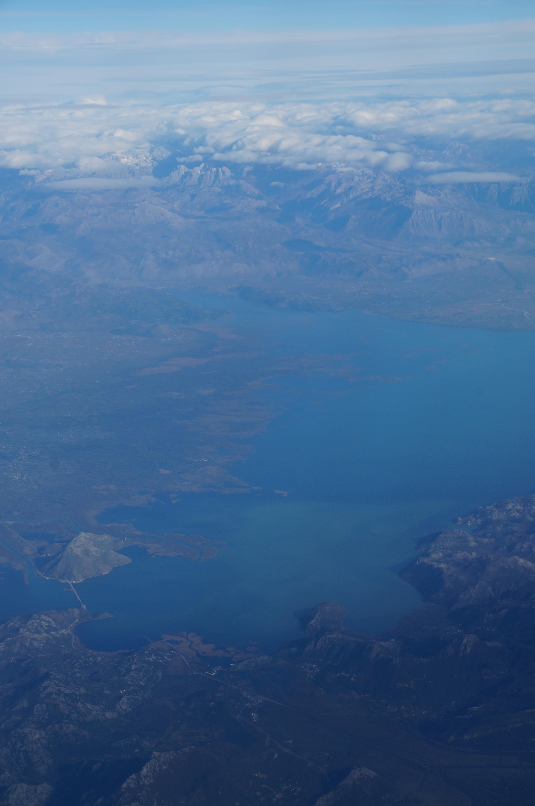
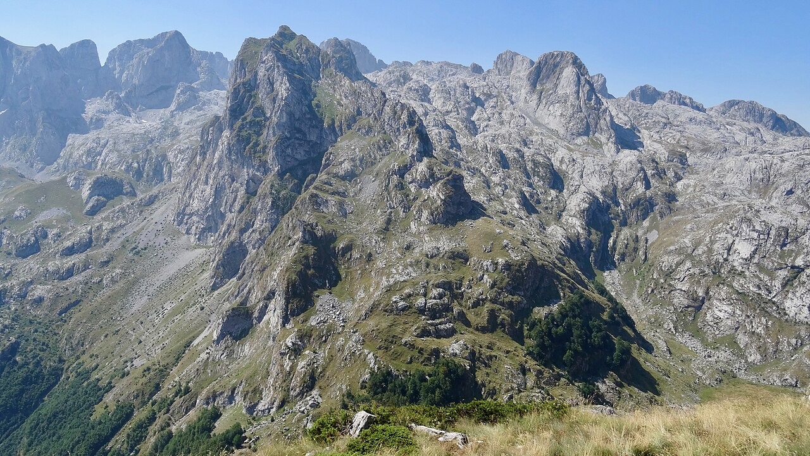
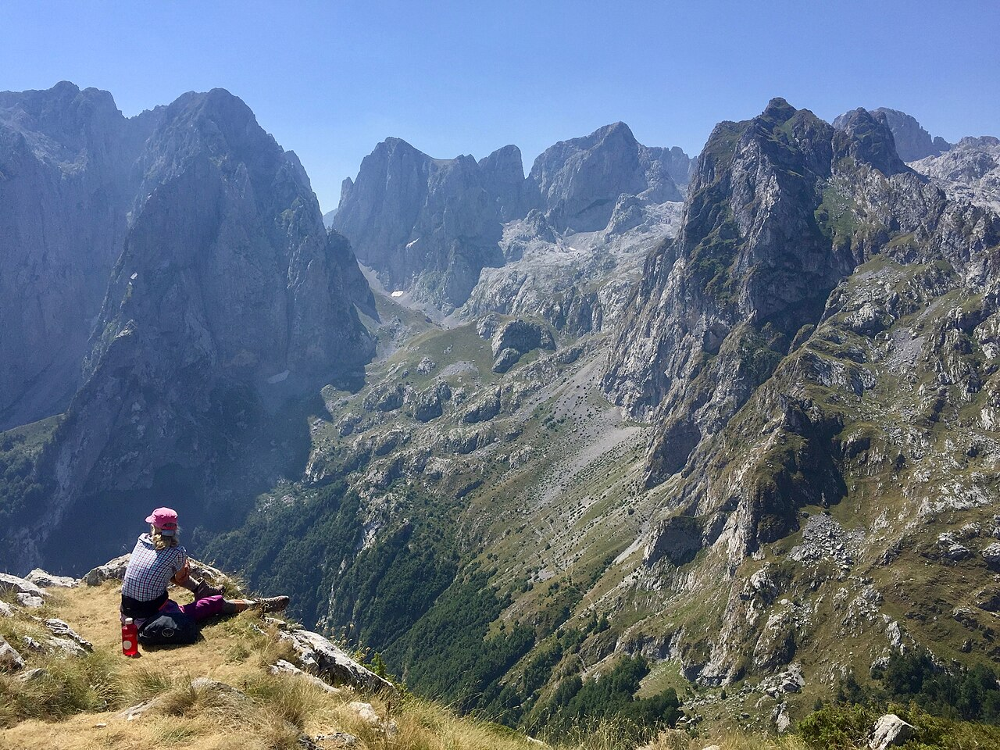
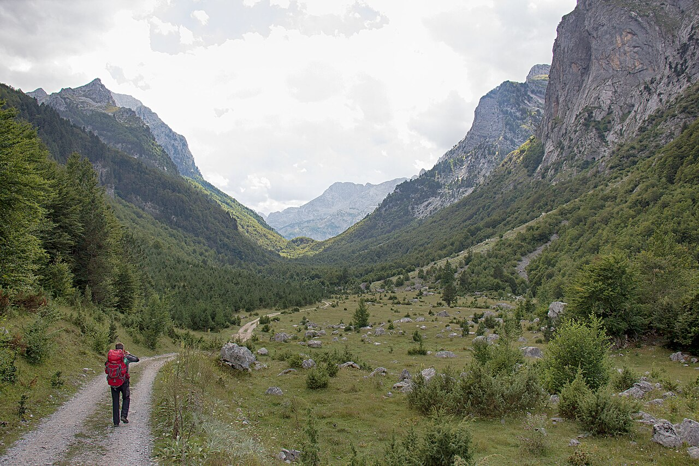

## Logistics
- **Start**: Uvac Canyon trailhead (Vidikovac Molitva) at **8:00 AM**
- **Destination**: Volušnica, Montenegro (Prokletije National Park)
- **ETA**: **12:00 PM** for trailhead, afternoon for summit hike
- **Driving time**: ~2.5 hours / 180 km
- **Border crossing**: Dobrakovica (RS) ↔ Jabuka (ME)
  - Expected wait: 20-40 minutes
  - Required docs: Passport, Green Card (insurance)
  - Vignette: Montenegrin vignette (~€7 for 7-day, buy at border)
- **Route**: Uvac → Sjenica → Skopje → Volušnica (via Zlatibor, then east along Montenegro border)
- **Road conditions**: Mountain passes, some winding, well-maintained
- **Tolls**: Minimal, vignette covers most

## Trails (AllTrails) — PRIMARY HIKE
- **Volušnica Summit via Grebaje Valley**
  - Trail: "Volušnica - Maja e Vajushës" from Grebaje Valley trailhead
  - **Distance**: **~12 km round trip**
  - **Elevation gain**: **~1,000 m** (Grebaje valley ~1,000m → summit ~1,879m)
  - Route type: Out-and-back
  - **Difficulty**: Hard (steep ascents, rocky terrain, exposed ridges)
  - Trailhead: Grebaje Valley, Montenegro (~42.5° N, 19.85° E)
  - Notable features:
    - Peak elevation **1,879 m** (Maja e Volušnicës / Volušnica Planina)
    - Dramatic limestone cliffs and alpine meadows
    - Views into Grebaje (Gerbja) Valley — one of the most glaciated valleys in the Accursed Mountains
    - Total time: **5-7 hours** (including breaks)
    - Best light: Early morning for sunrise views, late afternoon for golden light
    - Note: The **highest peak of the entire Accursed/Prokletije range is Maja Jezercë at 2,694m** (Albania). Volušnica is a more accessible and lower peak on the Montenegrin side.
  - **Trail source:** [Volušnica - Maja e Vajushës](https://www.alltrails.com/trail/montenegro/gusinje/volusnica-maja-e-vajushes) — AllTrails (verified real trail, Prokletije/Grebaje area)
- **Alternative**: Shorter "Krevica" side trail (6 km, +600 m) if fatigued

## Accommodations
- Search criteria used: "Airbnb near Volušnica Montenegro, mountain cabin, hiking gear storage, parking, Prokletije access"
- Examples:
  1. [Cottage in Heart of Prokletije](https://www.airbnb.com/grebaje-montenegro/stays) - **€70-90/night**, 2BR, mountain views, hiking gear storage, private deck, 10-min drive to trailhead
  2. [Martin's House](https://www.airbnb.com/martinovice-montenegro/stays) - **€60-80/night**, 1BR, rustic cabin, fireplace, kitchen, near trailhead
  3. [Prokletije Vučetić Sobe](https://www.airbnb.com/rooms/38020445) - **€40-60/night**, 1BR, eco-friendly, solar heating, close to Grebaje trailhead
- Check-in time: Flexible (message host for early/late)
- Parking: Free on-property, gravel lot
- Kitchen: Full kitchen access recommended for dinner prep

## Meals
- Breakfast: Self-catering with provisions from Uvac departure, or [Hostel Volušnica](https://www.google.com/maps/search/Hostel+Volusnica+Montenegro) - simple breakfast, coffee, pastries (**€5-8/person**)
- Lunch (on trail): Pack lunch from accommodation (energy bars, jerky, fruit)
- Lunch (alternative): [Restaurant Zlatibor](https://www.google.com/maps/search/Restaurant+Zlatibor+Montenegro) near Volušnica, local cuisine with grilled meats (**€10-15/person**)
- Dinner: [Restaurant Prokletije](https://www.google.com/maps/search/Restaurant+Prokletije+Gusinje+Montenegro) near Volušnica, hearty mountain stew, local wines (**€18-25/person**)

## Activities & Attractions (nearby, non-hiking)
- Prokletije National Park (entrance fee ~€3-5)
- Skopje (next day) — medieval stones, riverside park, museums
- Dobrakovica village — charming mountain village, local crafts
- Mount Jabuka — alternative summit (lower than Volušnica, ~1,700m)
- Grbidava waterfall — 20-min detour from trailhead, easy walk

## Links & Images
- Prokletije NP: [Official Info](https://en.wikipedia.org/wiki/Prokletije)
- Volušnica Summit: [Prokletije Mountains](https://en.wikipedia.org/wiki/Prokletije)
- Grebaje Valley: [Map](https://www.google.com/maps/place/Grebaje+Valley,+Montenegro)
- Image refs:
  - 
  - 
  - 
  - 
