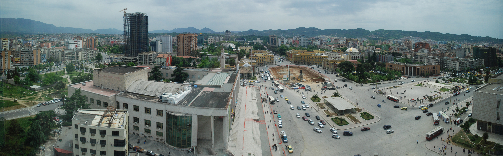
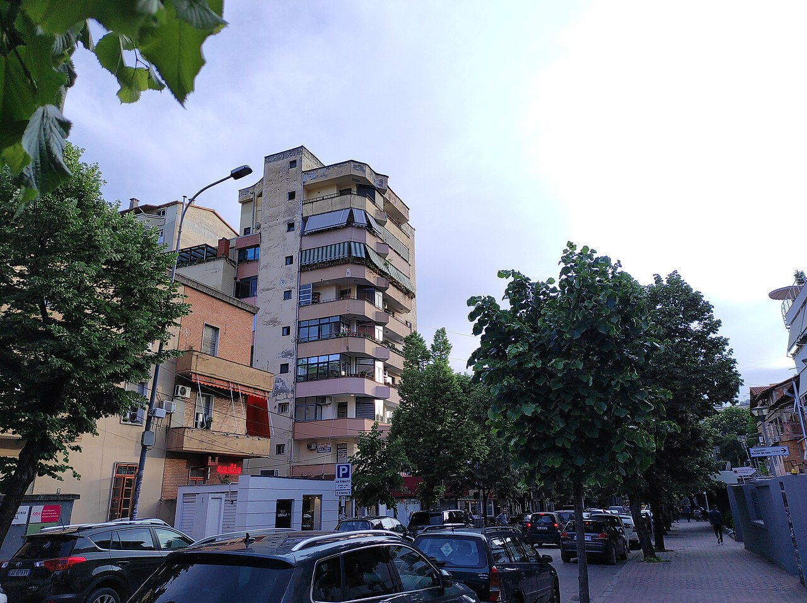
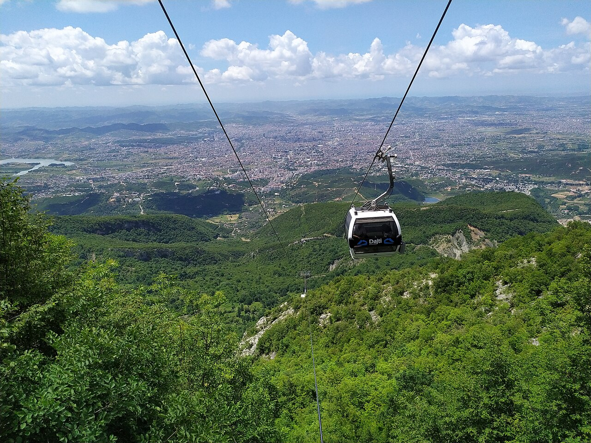
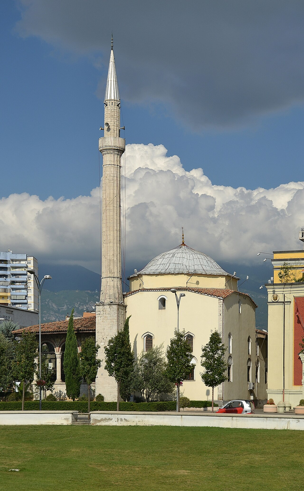

## Logistics
- Start: Volušnica accommodation at 7:30 AM
- Destination: Tirana, Albania
- ETA: 12:00 PM for city exploration
- Driving time: ~3.5 hours / 150 km
- Border crossing: Božaj (ME) ↔ Hani i Qerqit (AL)
  - Expected wait: 20-50 minutes (could be longer on weekends)
  - Required docs: Passport, Green Card (insurance)
  - Vignette: Albanian vignette (~€8 optional, mandatory for all vehicles under 3.5t)
- Route: From Volušnica, east through Petnjica, then south to Gusinje and across border to Shkodër, then south to Tirana
- Road conditions: Good highway from Gusinje to Shkodër, then A1 south to Tirana
- Tolls: Minimal on main road, vignette covers most
- Border tip: Pay with cash (EUR or ALL), be prepared for long queues on weekends

## Trails (AllTrails) — Afternoon hike option

- **Mali i Dajtit (Dajti Mountain)** — Day 5 afternoon hike
  - **Distance:** **~8–10 km** round trip
  - **Elevation gain:** **~600–800 m**
  - Route type: Out-and-back
  - **Difficulty:** Moderate
  - Trailhead: Dajti Express cable car base (Tirana) or forest trail from Dajti village
  - Notable features:
    - Dajti Mountain rises to **1,613 m** — panoramic views over Tirana and the Adriatic coast
    - Popular area with forest trails, the famous Dajti Express cable car, and Dajti Edelweiss Hotel
    - Can combine cable car up (€15–25/person) with hike on trail for different views
    - Afternoon hike after city arrival gives great sunset light over the capital
  - **Trail source:** [Mali i Dajtit](https://www.alltrails.com/trail/albania/tirana/mali-i-dajtit) — AllTrails verified trail, Dajti Mountain, Tirana area
- **Alternative:** Ujevara e Shengjergjit (Shengjergji Waterfall trail) — nature walk, easier

## Accommodations
- Search criteria used: "Airbnb Tirana Albania, rooftop terrace, city center, Blloku, parking"
- Examples:
  1. [CityViewTirana](https://www.airbnb.com/rooms/22741848) - **€60-80/night**, 2BR, rooftop terrace with mountain views, Blloku location, secure parking
  2. [Central Apartment in Blloku](https://www.airbnb.com/rooms/785480730131609288) - **€55-70/night**, 1BR, traditional Ottoman-era building, balcony overlooking Skanderbeg Square
  3. [Blloku Apartment with Terrace](https://www.airbnb.com/rooms/1160768057051778081) - **€45-65/night**, studio, new building, gym, rooftop pool, walking distance to nightlife
- Check-in time: Flexible afternoon (2:00 PM+)
- Parking: On-site or secure garage (essential in Tirana)
- Kitchen: Full kitchen or shared kitchen in old town properties

## Meals
- Breakfast: [Oda Tirana](https://www.google.com/maps/search/Oda+restaurant+Tirana+Albania) — Traditional Albanian breakfast with coffee, börek, and local cheese (€5-8/person)
- Lunch (en route): Rest stop at Shkodër, try [Restaurant Tradita](https://www.google.com/maps/search/Restaurant+Tradita+Shkoder+Albania) — Albanian comfort food near historic center (€10-15/person)
- Dinner: [Mullixhiu](https://www.google.com/maps/search/Mullixhiu+restaurant+Tirana+Albania) — Michelin-recommended modern Albanian cuisine, seasonal ingredients, creative dishes (€25-40/person), reservation recommended
- Alternative dinner: [Oda](https://www.google.com/maps/search/Oda+restaurant+Tirana+Blloku+Albania) — Traditional Albanian dishes in a restored Ottoman house, tavë kosi and qofte (€12-20/person)

## Activities & Attractions (nearby, non-hiking)
- Bunk'Art 1 & 2 (Cold War bunkers turned museums, €5 each)
- Skanderbeg Square (center of Tirana, large public square)
- Et'hem Bey Mosque (18th century, free entry)
- National Art Gallery (Albanian art, €3)
- Pyramid of Tirana (iconic, under renovation)
- New Bazaar (Pazari i Ri, great for local produce, crafts, coffee)
- Blloku neighborhood (trendy cafes, bars, restaurants)
- Mount Dajti National Park (cable car + easy hike option)
- Petrela Castle (15-min drive, medieval fortress, panoramic views)

## Links & Images
- Albanian vignette: [Toll Information](https://en.wikipedia.org/wiki/Vignette_(road_toll)#Albania)
- Tirana tourism: [Tirana](https://en.wikipedia.org/wiki/Tirana)
- Bunk'Art: [Bunk'Art 1](https://bunkart.com/)
- Dajti Ekspres: [Cable Car](https://www.dajtiekspres.com/)
- Image refs:
  - 
  - 
  - 
  - 