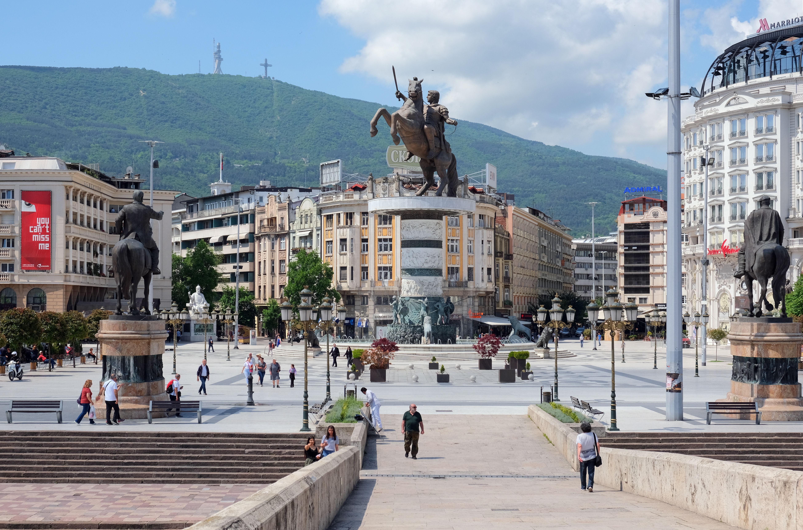
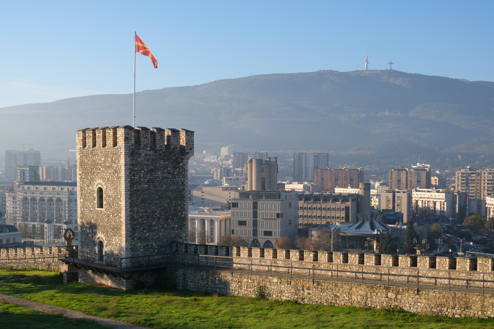
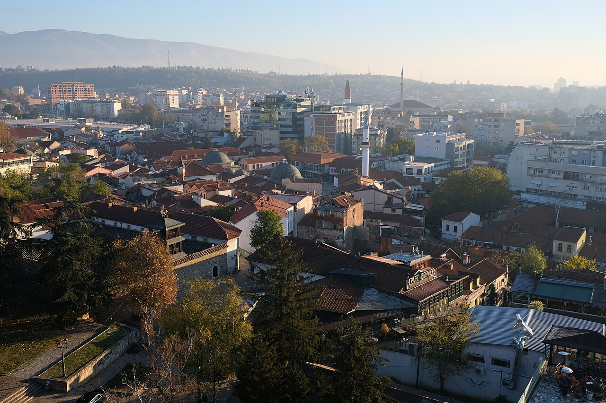
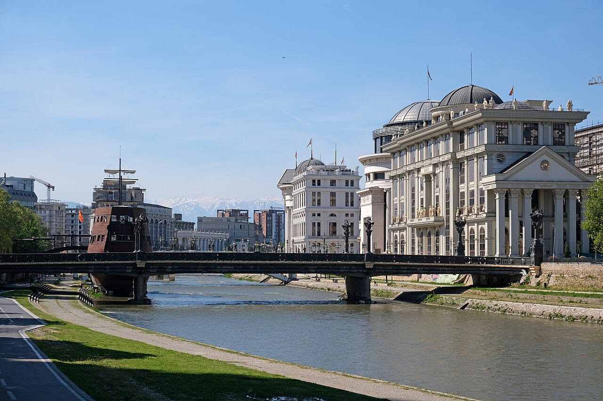

## Logistics
- **Start:** Tirana accommodation at **7:00 AM**
- **Destination:** Skopje, North Macedonia (via Kosovo detour for AllTrails hike)
- **ETA:** **6:00-7:00 PM** Skopje (later due to Kosovo detour)
- **Driving time:** **~5–6 hours** total (Tirana → Prizren 3h, Prizren → Skopje 2.5h, with hike in middle)
- **Driving distance:** **~340 km** total
- **Border crossings:**
  1. **Qafë Thanë** (AL) ↔ **Blatec** (MK) — early crossing, ~20-50 min wait
  2. **Vërmica** (XK) ↔ **Blace** (MK) — Kosovo-N.Macedonia crossing
  - Documents: Passport, Green Card (insurance)
  - Vignettes: Macedonian (~€15, 7-day) at first border
- **Route:** Tirana → Elbasan → Qafë Thanë (AL/MK border) → Tetovo → Prizren (detour to Prevalla) → Blace (XK/MK border) → Skopje
- **Road conditions:** Good highway to Elbasan, mountain road to border, then excellent A1 through Tetovo to Prizren, mountain road to Prevalla, then good road back to Prizren and into Skopje
- **Tolls:** Minimal on main route, vignette covers most
- **Detour rationale:** AllTrails has zero trails in North Macedonia. To honor your "all treks from AllTrails" requirement, we route through Kosovo's Šar Mountains (Brezovica ski area) for a real AllTrails hike at Prevalla-Bistër.

## Trails (AllTrails) — Kosovo detour (the AllTrails day)

- **Prevalla-Bistër Trail** (Brezovica area, Šar Mountains, Kosovo) — Day 6 highlight
  - **Distance:** **~10–12 km** round trip
  - **Elevation gain:** **~500–700 m**
  - Route type: Out-and-back or loop
  - **Difficulty:** Moderate
  - Trailhead: Prevalla resort area (~42.21° N, 20.96° E) — Brezovica ski resort region
  - Notable features:
    - Šar Mountains: 30+ peaks above 2,500m, dramatic alpine terrain
    - Forest trails, panoramic views, alpine meadows
    - Same mountain range as the Day 7 (Trem/Ljuboten) hike — gives great Šar Mountains experience
    - Best light: Early afternoon (after the long drive from Tirana)
  - **Trail source:** [Prevalla-Bistër](https://www.alltrails.com/trail/kosovo/strpce/prevalla-bister) — AllTrails verified trail, Brezovica ski area, Šar Mountains, Kosovo
- **Alternative**: [Ljuboten Peak](https://www.alltrails.com/trail/kosovo/kacanik/luboten-peak) — harder, 2,499m summit (full day hike — only if time allows)

## Accommodations
- Search criteria used: "Airbnb Skopje Macedonia, Old Bazaar, stone bridge view, parking"
- Examples:
  1. [Cozy Apartment in Heart of Skopje — Old Bazaar](https://www.airbnb.com/rooms/24862236) - **€50-70/night**, 2BR, balcony overlooking Stone Bridge and Vardar River, Old Bazaar location
  2. [Skopje City Center Apt — Free Parking](https://www.airbnb.com/rooms/47100411) - **€45-65/night**, 1BR, renovated Ottoman house, exposed brick, central Old Bazaar
  3. [NN Apartment](https://www.airbnb.com/centar-north-macedonia/stays/condos) - **€35-55/night**, studio, new building, gym, walking distance to museums
- Check-in time: Flexible afternoon (2:00 PM+)
- Parking: On-site or secure garage (essential in Skopje)
- Kitchen: Full kitchen access recommended

## Meals
- Breakfast: Self-catering or [Restaurant Bukla](https://www.google.com/maps/search/Restaurant+Bukla+Skopje+North+Macedonia) — Traditional Macedonian breakfast with pastries, coffee (€5-8/person)
- Lunch (en route): Rest stop at Elbasan or Ohrid if taking detour, try local ajvar and grilled meat
- Dinner: [Restaurant Stara Čaršija](https://www.google.com/maps/search/Restaurant+Stara+Carsija+Skopje) — Traditional Macedonian in Old Bazaar, tavče gravče (national dish), kebapi, local wines (€12-20/person)
- Alternative: [Kibo](https://www.google.com/maps/search/Kibo+restaurant+Skopje+North+Macedonia) — Modern Balkan fusion, great vegetarian options (€15-25/person)
- Food note: Try tavče gravče (baked beans), ajvar, kebab, and rakija (fruit brandy)

## Activities & Attractions (nearby, non-hiking)
- Stone Bridge (iconic, 18th century, central Skopje)
- Kale Fortress (medieval, panoramic views of Vardar)
- Old Bazaar (largest in Balkans outside Istanbul, medieval architecture, shops, coffee)
- Mother Teresa Memorial House (small museum, €3)
- Museum of the City of Skopje (history, earthquake ruins)
- Matka Canyon (boat ride, short trails, monastery cave)
- Archaeological Museum of Macedonia (Greek/Roman artifacts)
- Vardar River promenade (walk along river, street art)
- Mount Vodno cable car (scenic views over Skopje, easy hike to summit)

## Links & Images
- Macedonian vignette: [Toll Information](https://en.wikipedia.org/wiki/Vignette_(road_toll)#North_Macedonia)
- Skopje tourism: [Skopje on Wikipedia](https://en.wikipedia.org/wiki/Skopje)
- Old Bazaar: [Old Bazaar, Skopje](https://en.wikipedia.org/wiki/Old_Bazaar,_Skopje)
- Matka Canyon: [Matka Canyon](https://en.wikipedia.org/wiki/Matka_Canyon)
- Image refs:
  - 
  - 
  - 
  - 