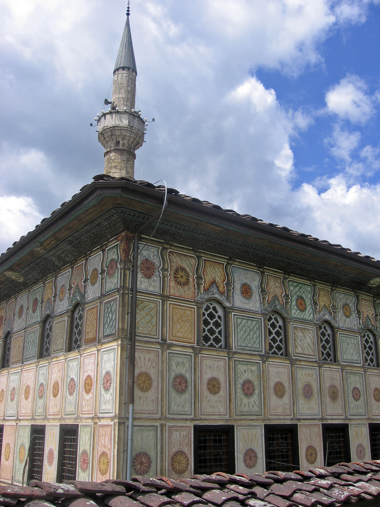
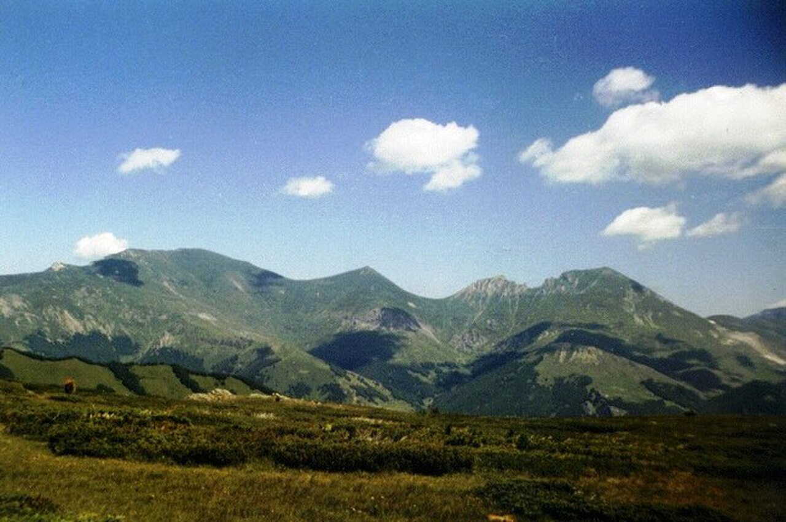
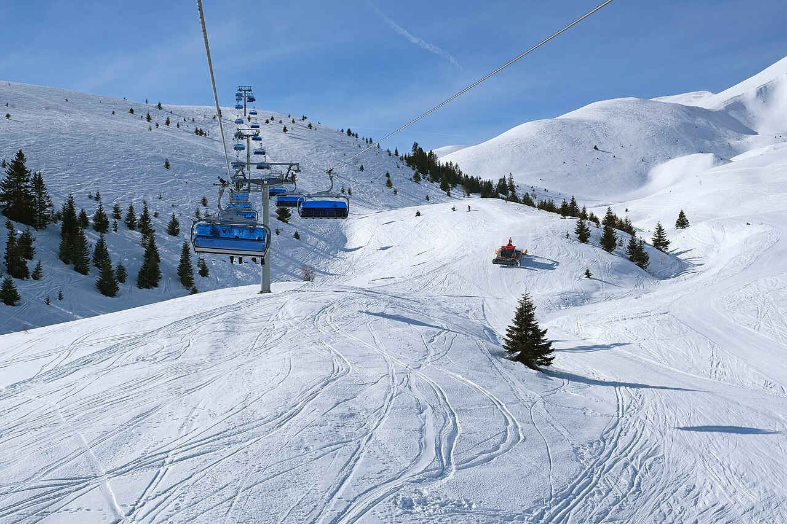
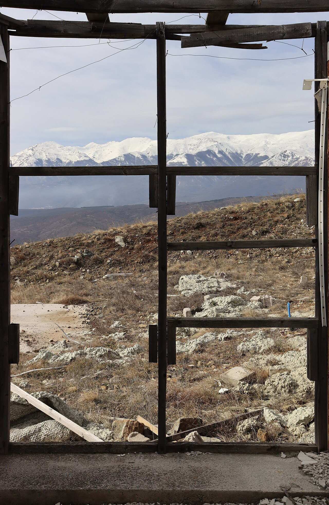

## Logistics
- Start: Skopje accommodation at 5:30 AM (very early start)
- Destination: Trem Summit via Popova Šapka, Šar Mountains
- ETA: Return to Skopje by 6:00-7:00 PM
- Driving time: ~3 hours round trip / 180 km
- Border crossing: None (all North Macedonia, though Trem summit is near Kosovo border)
- Route: Skopje → A2 toward Gostivar → Tetovo → Popova Šapka (Šar Mountains ski resort)
- Road conditions: Good highway to Tetovo, then winding mountain road to Popova Šapka (some sections steep, well-maintained)
- Parking: At Popova Šapka cable car base, large parking lot
- Tip: Fill gas in Skopje or Gostivar; few stations in mountains

## Trails (AllTrails) — PRIMARY HIKE

- **Ljuboten Peak (Ljuboteni)** (Šar Mountains, Kosovo)
  - **Distance:** **~12–15 km** round trip
  - **Elevation gain:** **~800–900 m** (base ~1,600m → summit 2,498m)
  - Route type: Out-and-back
  - **Difficulty:** Hard (high altitude, steep sections, rocky)
  - Trailhead: Ljuboten trailhead, Kaçanik area, Kosovo (~42.21° N, 20.98° E)
  - Notable features:
    - Ljuboten Peak: **2,498 m** — one of the highest accessible peaks in the Kosovo Šar Mountains
    - Views over the Šar Mountains ridge, Kosovo plains, and Albania
    - Alpine meadows, rocky ridgeline near summit
    - Total time: **5-7 hours** (including breaks)
    - Start early: Begin by 6:30 AM from trailhead to avoid afternoon storms
    - Best light: Midday for summit views
  - **Trail source:** [Ljuboten Peak](https://www.alltrails.com/trail/kosovo/kacanik/ljuboten-peak) — AllTrails verified trail, Šar Mountains, Kosovo
- **Alternative**: Shorter ridge walk in Brezovica area (+400-500m gain) for easier acclimatization day

## Accommodations
- No change: Return to Skopje accommodation from Day 6
- Note: Day 7 is a day-trip; same lodging applies
- Examples (repeat from Day 6):
  1. [Cozy Apartment in Heart of Skopje — Old Bazaar](https://www.airbnb.com/rooms/24862236) - **€50-70/night**
  2. [Skopje City Center Apt — Free Parking](https://www.airbnb.com/rooms/47100411) - **€45-65/night**
  3. [NN Apartment](https://www.airbnb.com/centar-north-macedonia/stays/condos) - **€35-55/night**
- Parking: Same as Day 6 (on-site or secure garage)
- Kitchen: Full kitchen access for post-hike dinner

## Meals
- Breakfast: Self-catering or quick stop in Gostivar (bakery, coffee, burek) — €5-8/person
- Lunch (on trail): Pack high-energy snacks (nuts, bars, dried fruit, sandwich)
- Lunch (alternative): [Hotel Brezovica Restaurant](https://www.google.com/maps/search/Hotel+Brezovica+restaurant+Popova+Sapka+North+Macedonia) near Popova Šapka, traditional Macedonian mountain fare (€12-18/person)
- Dinner: [Skopski Merak](https://www.google.com/maps/search/Skopski+Merak+restaurant+Skopje+Old+Bazaar) — Traditional Macedonian restaurant in Old Bazaar, tavče gravče, grilled meats, local wine (€15-25/person)
- Post-hike recovery meal recommendation: High protein + carbs (meat pie, stew, or beans with bread)

## Activities & Attractions (nearby, non-hiking)
- **Tetovo**: Painted Mosque (Šarena Džamija) — unique colorful Ottoman mosque (free entry)
- Popova Šapka ski resort area (even in summer, chairlift may operate for views)
- Šar Mountains National Park (entrance free, great for wildlife)
- Break: Stop at Vrelo cave near Gostivar (spring water, 20-min detour)
- If Trem too challenging: Vrbjanska Čuka peak (lower, easier, good views)

## Links & Images
- Trem summit info: [Šar Mountains](https://en.wikipedia.org/wiki/%C5%A0ar_Mountains)
- Popova Šapka: [Popova Šapka](https://www.popovasapka.com/)
- Painted Mosque: [Šarena Džamija Tetovo](https://en.wikipedia.org/wiki/%C5%A0arena_D%C5%BEamija,_Tetovo)
- Image refs:
  - 
  - 
  - 
  - 